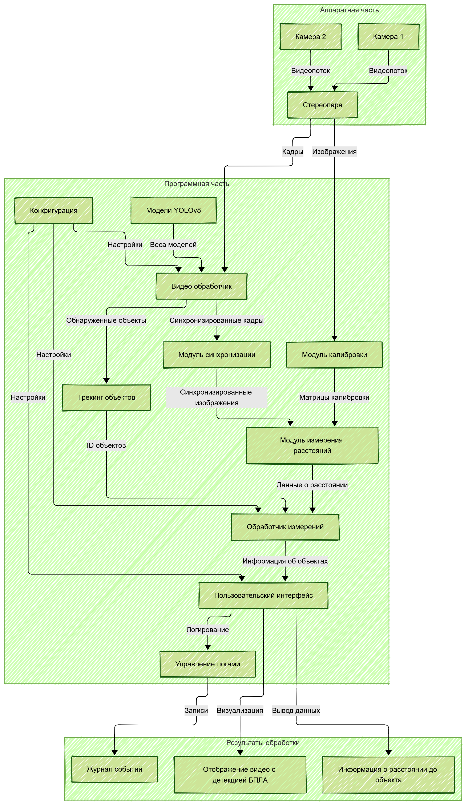
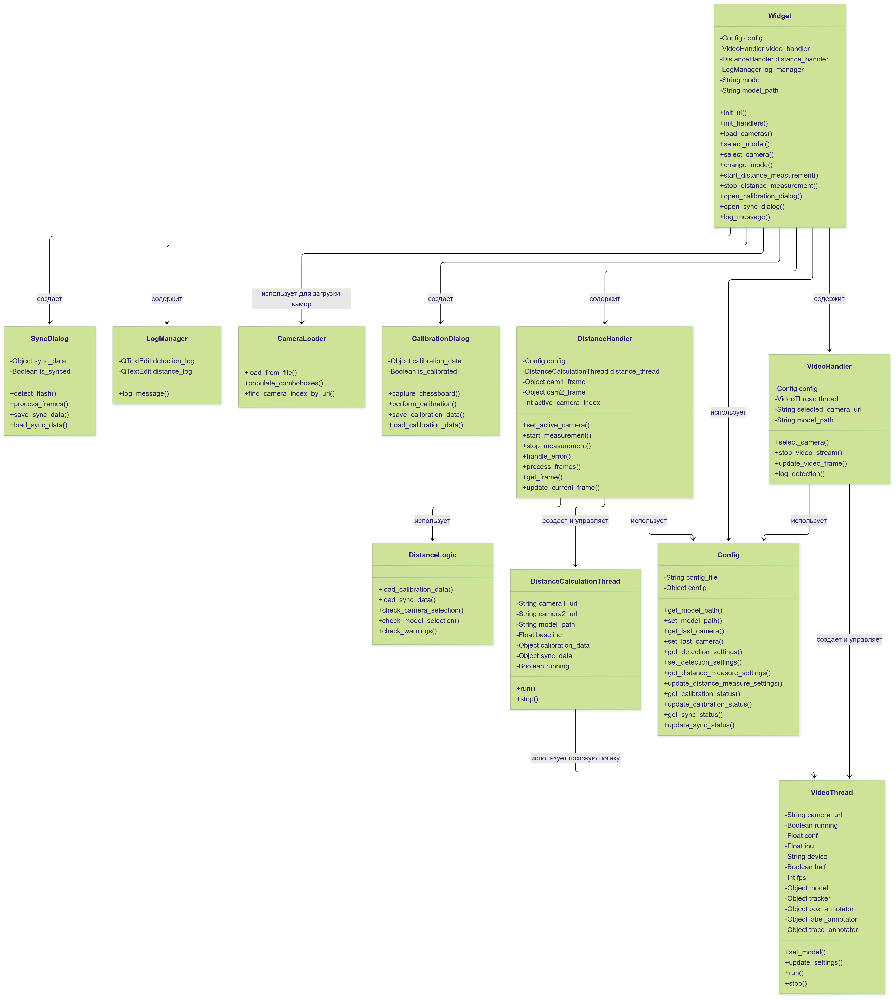
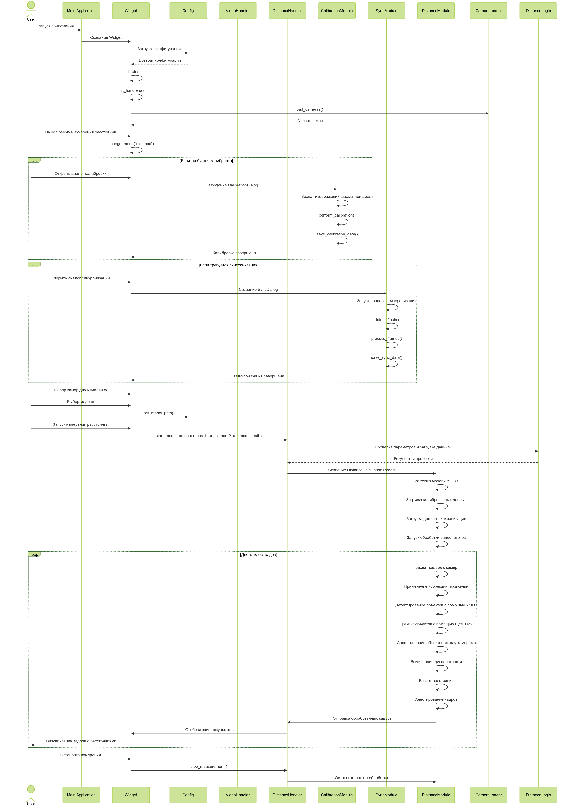

<div id="top">

<!-- HEADER STYLE: CLASSIC -->
<div align="center">


# Выпускная квалификационная работа
# Проектирование и макетирование системы мониторинга БПЛА
</div>
<br>


Государственный университет "Дубна". Образовательное направление: 09.03.04 Программная инженерия

Автор:  Терешкин Дмитрий Александрович, 4253

Руководитель: доцент, Задорожный Александр Михайлович

# Содержание

- [Содержание](#содержание)
- [Краткое описание проекта](#краткое-описание-проекта)
  - [Сущность дипломного проекта](#сущность-дипломного-проекта)
  - [Научно-практическая значимость](#научно-практическая-значимость)
  - [Основные возможности системы](#основные-возможности-системы)
  - [Техническая архитектура](#техническая-архитектура)
- [Технологический стек проекта](#технологический-стек-проекта)
- [Структура проекта](#структура-проекта)
- [Архитектура и диаграммы проекта](#архитектура-и-диаграммы-проекта)
  - [Общая архитектура системы](#общая-архитектура-системы)
  - [Диаграмма классов](#диаграмма-классов)
  - [Диаграммы последовательности](#диаграммы-последовательности)
- [Начало работы](#начало-работы)
  - [Предварительные требования](#предварительные-требования)
  - [Установка](#установка)
  - [Использование](#использование)
- [Контакты](#контакты)

---
## Краткое описание проекта

Данный дипломный проект представляет собой комплексную систему мониторинга беспилотных летательных аппаратов (БПЛА), разработанную в рамках выпускной квалификационной работы по направлению "Программная инженерия". 

### Сущность дипломного проекта

Проект представляет собой **макет системы визуального мониторинга БПЛА** на основе компьютерного зрения и машинного обучения. Макет системы предназначен для решения актуальных задач обеспечения безопасности воздушного пространства и контроля полетов дронов.

### Научно-практическая значимость

- **Актуальность**: Рост популярности БПЛА требует развития эффективных систем мониторинга и контроля
- **Инновационность**: Использование стереозрения для точного определения расстояния до объектов

### Основные возможности системы

- **Детекция и трекинг БПЛА** в реальном времени с использованием нейронных сетей YOLOv8
- **Стереоскопическое измерение расстояний** до обнаруженных объектов
- **Автоматическая калибровка стереопары камер** с использованием шахматной доски
- **Синхронизация видеопотоков** для корректной работы стереозрения
- **Интуитивный графический интерфейс** для мониторинга и управления системой
- **Комплексное логирование** всех событий и результатов обработки

### Техническая архитектура

Система построена на модульной архитектуре, включающей:
- **Слой захвата данных**: Работа с видеопотоками от одной или двух камер
- **Слой обработки**: Модули калибровки, синхронизации и измерения расстояний
- **Слой машинного обучения**: Интеграция с предобученными моделями YOLOv8
- **Слой представления**: GUI на базе PySide6

Основная цель — предоставить комплексный инструмент для исследователей и инженеров, занимающихся анализом полета дронов, контролем воздушного пространства и разработкой систем безопасности.

## Технологический стек проекта

+ Язык программирования: Python 3.11
+ GUI-фреймворк: PySide6 (Qt)
+ Компьютерное зрение и ML:
  - OpenCV (захват и обработка видео, калибровка и ректификация)
  - NumPy (линейная алгебра, работа с массивами)
  - Ultralytics YOLOv8 (детектирование и трекинг объектов)
+ Параллельная обработка:
  - QThread (многопоточность для обработки видеопотоков)
+ Инструменты и утилиты:
  - Git (контроль версий)
  - pip (управление зависимостями)
  - venv (виртуальные окружения)

## Структура проекта

```sh
└── BPLA_DIPLOM/
    ├── models/                      # Каталог с моделями YOLO
    │   ├── AOD_detection_model_yolo12n.pt
    │   ├── BPLA_model_10-11-2024.pt
    │   ├── united_datasets_airplane_birds_drone_11-03-2025.pt
    │   └── yolov8m_coco.pt
    ├── src/                         # Исходный код проекта
    │   ├── core/                    # Ядро приложения
    │   │   ├── __init__.py
    │   │   ├── config.py            # Управление конфигурацией
    │   │   └── distance_logic.py    # Логика для измерения расстояний
    │   ├── handlers/                # Обработчики событий и потоков
    │   │   ├── __init__.py
    │   │   ├── distance_handler.py  # Обработчик измерения расстояний
    │   │   ├── log_manager.py       # Управление логами
    │   │   └── video_handler.py     # Обработчик видеопотока
    │   ├── modules/                 # Функциональные модули
    │   │   ├── __init__.py
    │   │   ├── calibration_module.py # Модуль калибровки камер
    │   │   ├── distance_module.py   # Модуль измерения расстояний
    │   │   └── sync_module.py       # Модуль синхронизации камер
    │   ├── ui/                      # Компоненты пользовательского интерфейса
    │   │   ├── __init__.py
    │   │   ├── app_styles.py        # Стили приложения
    │   │   ├── settings_dialog.py   # Диалог настроек
    │   │   └── ui_components.py     # Фабрика UI компонентов
    │   ├── utils/                   # Вспомогательные утилиты
    │   │   ├── __init__.py
    │   │   ├── camera_loader.py     # Загрузка камер из файла
    │   │   └── camera_utils.py      # Утилиты для работы с камерами
    │   ├── __init__.py
    │   └── widget.py                # Основной виджет приложения
    ├── videos/                      # Тестовые видеофайлы
    │   ├── airplane.mp4
    │   ├── birds.mp4
    │   ├── kakoi-to-drone-vodyanoy.mp4
    │   ├── roi_dronov_vodyanoy.mp4
    │   └── rutube-uav-fire.mp4
    ├── .gitignore
    ├── cameras.txt                  # Список камер/видеопотоков
    ├── LICENSE
    ├── logo.png                     # Логотип приложения
    ├── main.py                      # Точка входа в приложение
    ├── README.md
    ├── requirements.txt             # Зависимости проекта
    └── settings.json                # Файл конфигурации
```

# Архитектура и диаграммы проекта

## Общая архитектура системы

### Краткая архитектурная схема


### Подробная архитектурная схема  


## Диаграмма классов


*Диаграмма классов демонстрирует основные компоненты системы: главный виджет приложения (Widget), модули конфигурации (Config), обработчики видео и измерения расстояний, а также специализированные модули для калибровки, синхронизации и измерения расстояний.*

## Диаграммы последовательности

### Общий процесс работы системы


### Процесс детектирования объектов


### Процесс калибровки камер


*Процесс калибровки включает захват изображений шахматной доски, вычисление внутренних параметров камер и сохранение калибровочных данных.*

### Процесс синхронизации камер


*Синхронизация обеспечивает временное выравнивание кадров от двух камер для корректной работы стереозрения.*

### Процесс измерения расстояний


*Измерение расстояний основано на принципах стереозрения: анализе диспаратности между соответствующими точками на изображениях с двух камер.*

### Загрузка и применение настроек


*Система поддерживает гибкую конфигурацию через файл настроек, позволяя адаптировать параметры детекции и измерений под конкретные задачи.*

## Начало работы

### Предварительные требования

- **Язык программирования:** Python
- **Менеджер пакетов:** pip

### Установка

Соберите BPLA_DIPLOM из исходного кода и установите зависимости:

1. **Клонируйте репозиторий:**

    ```sh
      git clone https://github.com/Yagiar/BPLA_DIPLOM
    ```

2. **Перейдите в директорию проекта:**

    ```sh
      cd BPLA_DIPLOM
    ```

3. **Установите зависимости:**

	```sh
	  pip install -r requirements.txt
	```

### Использование

Запустите проект с помощью:


```sh
   python main.py
```

---

## Контакты
ФИО: Терешкин Дмитрий Александрович

Email: alexrumling2000@gmail.com

TG: @Otrix_ai

VK: https://vk.com/otrix_ai

---
<div align="right">

[![][back-to-top]](#top)

</div>


[back-to-top]: https://img.shields.io/badge/-BACK_TO_TOP-151515?style=flat-square

