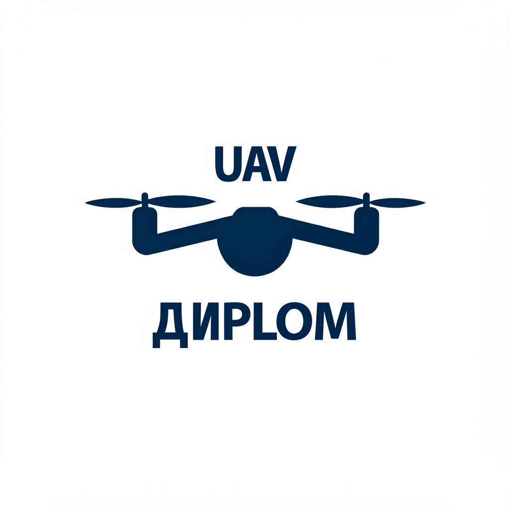

<div id="top">

<!-- HEADER STYLE: CLASSIC -->
<div align="center">



# BPLA_DIPLOM

<em></em>

<!-- BADGES -->


<!-- default option, no dependency badges. -->


<!-- default option, no dependency badges. -->

</div>
<br>

---

## Table of Contents

- [Table of Contents](#table-of-contents)
- [Overview](#overview)
- [Features](#features)
- [Project Structure](#project-structure)
    - [Project Index](#project-index)
- [Getting Started](#getting-started)
    - [Prerequisites](#prerequisites)
    - [Installation](#installation)
    - [Usage](#usage)
    - [Testing](#testing)
- [Roadmap](#roadmap)
- [Contributing](#contributing)
- [License](#license)
- [Acknowledgments](#acknowledgments)

---

## Overview


---

## Features

<code>❯ REPLACE-ME</code>

---

## Project Structure

```sh
└── BPLA_DIPLOM/
    ├── models/                      # Каталог с моделями YOLO
    │   ├── AOD_detection_model_yolo12n.pt
    │   ├── BPLA_model_10-11-2024.pt
    │   ├── united_datasets_airplane_birds_drone_11-03-2025.pt
    │   └── yolov8m_coco.pt
    ├── src/                         # Исходный код проекта
    │   ├── core/                    # Ядро приложения
    │   │   ├── __init__.py
    │   │   ├── config.py            # Управление конфигурацией
    │   │   └── distance_logic.py    # Логика для измерения расстояний
    │   ├── handlers/                # Обработчики событий и потоков
    │   │   ├── __init__.py
    │   │   ├── distance_handler.py  # Обработчик измерения расстояний
    │   │   ├── log_manager.py       # Управление логами
    │   │   └── video_handler.py     # Обработчик видеопотока
    │   ├── modules/                 # Функциональные модули
    │   │   ├── __init__.py
    │   │   ├── calibration_module.py # Модуль калибровки камер
    │   │   ├── distance_module.py   # Модуль измерения расстояний
    │   │   └── sync_module.py       # Модуль синхронизации камер
    │   ├── ui/                      # Компоненты пользовательского интерфейса
    │   │   ├── __init__.py
    │   │   ├── app_styles.py        # Стили приложения
    │   │   ├── settings_dialog.py   # Диалог настроек
    │   │   └── ui_components.py     # Фабрика UI компонентов
    │   ├── utils/                   # Вспомогательные утилиты
    │   │   ├── __init__.py
    │   │   ├── camera_loader.py     # Загрузка камер из файла
    │   │   └── camera_utils.py      # Утилиты для работы с камерами
    │   ├── __init__.py
    │   └── widget.py                # Основной виджет приложения
    ├── videos/                      # Тестовые видеофайлы
    │   ├── airplane.mp4
    │   ├── birds.mp4
    │   ├── kakoi-to-drone-vodyanoy.mp4
    │   ├── roi_dronov_vodyanoy.mp4
    │   └── rutube-uav-fire.mp4
    ├── .gitignore
    ├── cameras.txt                  # Список камер/видеопотоков
    ├── LICENSE
    ├── logo.png                     # Логотип приложения
    ├── main.py                      # Точка входа в приложение
    ├── README.md
    ├── requirements.txt             # Зависимости проекта
    └── settings.json                # Файл конфигурации
```

## Getting Started

### Prerequisites

This project requires the following dependencies:

- **Programming Language:** Python
- **Package Manager:** Pip

### Installation

Build BPLA_DIPLOM from the source and intsall dependencies:

1. **Clone the repository:**

    ```sh
      git clone https://github.com/Yagiar/BPLA_DIPLOM
    ```

2. **Navigate to the project directory:**

    ```sh
      cd BPLA_DIPLOM
    ```

3. **Install the dependencies:**

	```sh
	  pip install -r requirements.txt
	```

### Usage

Run the project with:

**Using [pip](https://pypi.org/project/pip/):**
	```sh
	  python main.py
	```

---

## License

Bpla_diplom is protected under the [LICENSE](https://choosealicense.com/licenses) License. For more details, refer to the [LICENSE](https://choosealicense.com/licenses/) file.

---

## Acknowledgments

- Credit `contributors`, `inspiration`, `references`, etc.

<div align="right">

[![][back-to-top]](#top)

</div>


[back-to-top]: https://img.shields.io/badge/-BACK_TO_TOP-151515?style=flat-square


---
